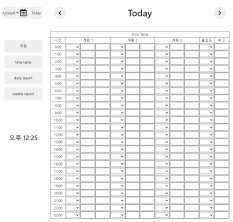
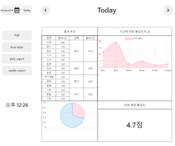

# Daily Report 프로젝트
#### 팀원 : 김도형, 권규원, 마서현, 방민수, 이동민
#### 작업공간 : [노션](https://www.notion.so/12-c7b8bb83f4a74fa1bb96c4eb45b9fe3f), 게더타운, 카톡
 

 

* ## Project
    * 

        
아이디어

         
  
        

         
          
    * 

        
목적

         
  
        

         
        
 

* ## Frontend
    * 

        
디자인

         
  
        

         
          
    * 

        
플러그인, 기술

         
  
        

         
        
    * 

        
그리드

         
  
        

         

    * 

        
기능구현

         
  
        

         

 

* ## Backend
    * 

        
디자인

         
  
        

         
          
    * 

        
API

         
  
        

         

    * 

        
기능구현

         
  
        

         
